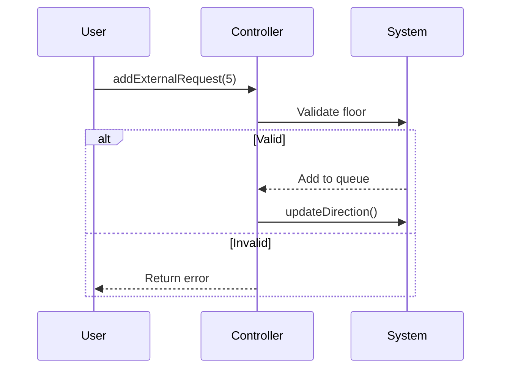

## Решение тестового для СГК

### Тестовое задание Управление лифтом

* Инициализация

Лифт начинает работу на 1 этаже (минимальный допустимый этаж)

Направление движения устанавливается в IDLE (бездействие)

* Обработка запросов

При получении нового запроса (внутреннего или внешнего):

1. Проверяется валидность этажа (1–9).

2. Этаж добавляется в соответствующий набор запросов:

`internal_requests_` — для вызовов из кабины.

`external_requests_` — для вызовов с этажей.

3. Обновляется направление движения (updateDirection()).


c. Обновляем направление движения (`updateDirection()`)

* Логика движения (`move()`)

  - Если направление IDLE - лифт не двигается

  - Удаляем текущий этаж из запросов (если был)

  - Перемещаемся на 1 этаж в текущем направлении

  - Удаляем новый текущий этаж из запросов (если был)

  - Обновляем направление движения
  

* Определение направления (`updateDirection()`)

  - Удаляем текущий этаж из всех запросов

  - Если запросов нет - устанавливаем IDLE

  - Если движемся ВВЕРХ и есть запросы выше - продолжаем ВВЕРХ

  - Если движемся ВНИЗ и есть запросы ниже - продолжаем ВНИЗ

  - При IDLE выбираем направление к ближайшему запросу


* Проверка запросов

  - `hasRequests()` - есть ли вообще запросы

  - `hasRequestsAbove()` - есть ли запросы выше текущего этажа

  - `hasRequestsBelow()` - есть ли запросы ниже текущего этажа




### How to build

```sh
mkdir build && cd build
cmake .. -G=Ninja # or another generator
ninja -j4 # or another number of thread
./TEST_TASK_SGK.exe 
```